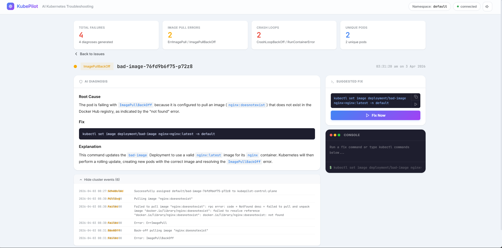

# KubePilot



AI-driven Kubernetes troubleshooting agent that watches for failing pods, collects their events, and uses a large language model to explain the root cause and suggest a fix.

Diagnosis reports are optionally persisted to a GCS bucket for historical auditing.

## Architecture

```
                                        ┌────────────────────────────────┐
┌──────────────┐     watch stream       │  KubePilot Engine              │
│  Kind Cluster│ ──────────────────▸    │                                │
│  (local K8s) │                        │  detect failure → fetch events │
└──────────────┘                        │  → build prompt → Gemini      │
                                        │       │                       │
                                        │       ▾                       │
                                        │  ┌──────────┐  ┌───────────┐ │
                                        │  │ CLI (Rich)│  │ Dashboard │ │
                                        │  │ main.py   │  │ :8080     │ │
                                        │  └──────────┘  └─────┬─────┘ │
                                        │       │              │ SSE    │
                                        │       ▾              ▾        │
                                        │  GCS upload    Browser UI     │
                                        └────────────────────────────────┘
```

Two interfaces share the same detection engine:

- **CLI** (`python main.py`) — Rich-formatted terminal output.
- **Dashboard** (`python dashboard.py`) — real-time web UI at `http://localhost:8080` using FastAPI + Server-Sent Events.

## Prerequisites

| Tool | Version | Purpose |
|------|---------|---------|
| Docker | 20+ | Container runtime for Kind |
| Terraform | >= 1.3 | Infrastructure provisioning |
| kubectl | 1.25+ | Cluster interaction |
| Kind | 0.20+ | Local Kubernetes clusters |
| Python | 3.10+ | Agent runtime |
| gcloud CLI | latest | GCP authentication |

You also need:

- A **Gemini API key** (https://aistudio.google.com/apikey).
- A **GCP project** with billing enabled and the Cloud Storage API active.

## Quick Start

### 1. Authenticate with GCP

```bash
gcloud auth application-default login
```

### 2. Provision infrastructure

```bash
cd KubernetesPilot
terraform init
terraform apply -var="gcp_project_id=YOUR_GCP_PROJECT_ID"
```

Terraform creates a local Kind cluster and a GCS bucket. Note the `gcs_bucket_name` in the output.

### 3. Verify the cluster

```bash
kubectl cluster-info --context kind-kubepilot
```

### 4. Deploy the broken workloads

```bash
kubectl apply -f broken-deployment.yaml
kubectl create deployment bad-image --image=nginx:doesnotexist -n default
```

This creates two intentionally failing deployments:

- **broken-nginx** — uses a non-existent image tag (`nginx:super-latest-broken`) → `ImagePullBackOff`
- **crashloop-app** — runs `exit 1` in a loop → `CrashLoopBackOff`

### 5. Install Python dependencies

```bash
pip install -r requirements.txt
```

### 6. Set environment variables

**Linux / macOS:**

```bash
export GEMINI_API_KEY="your-gemini-api-key"
export GCS_BUCKET_NAME="$(terraform output -raw gcs_bucket_name)"
```

**PowerShell:**

```powershell
$env:GEMINI_API_KEY = "your-gemini-api-key"
$env:GCS_BUCKET_NAME = (terraform output -raw gcs_bucket_name)
```

`GCS_BUCKET_NAME` is optional — if omitted the agent still runs but skips cloud uploads.

### 7. Run KubePilot

**Option A — CLI mode:**

```bash
python main.py
```

The agent streams pod events and prints a diagnosis for each failure it detects. Press **Ctrl+C** to stop.

**Option B — Web dashboard:**

```bash
python dashboard.py
```

Open `http://localhost:8080` in your browser. Diagnosis cards appear in real time as failures are detected. The dashboard uses Server-Sent Events so there is no need to refresh.

## Configuration

| Variable | Required | Default | Description |
|----------|----------|---------|-------------|
| `GEMINI_API_KEY` | yes | — | Google Gemini API key |
| `GCS_BUCKET_NAME` | no | — | GCS bucket for diagnosis reports |
| `KUBEPILOT_NAMESPACE` | no | `default` | Namespace to watch |
| `GEMINI_MODEL` | no | `gemini-2.0-flash` | Model used for diagnosis |

## Cleanup

```bash
kubectl delete -f broken-deployment.yaml
terraform destroy -var="gcp_project_id=YOUR_GCP_PROJECT_ID"
```

## Troubleshooting

**`Could not locate a valid kubeconfig`**
Ensure the Kind cluster is running (`kind get clusters`) and `~/.kube/config` contains the `kind-kubepilot` context.

**`GEMINI_API_KEY is not set`**
Export the variable in the same shell session where you run `main.py`.

**`GCS init skipped`**
Run `gcloud auth application-default login` and confirm the Cloud Storage API is enabled in your project.

**Docker not running**
Kind requires Docker. Start Docker Desktop (or the Docker daemon) before running `terraform apply`.

**Dashboard port already in use**
Change the port with `uvicorn dashboard:app --host 0.0.0.0 --port 9090`.
